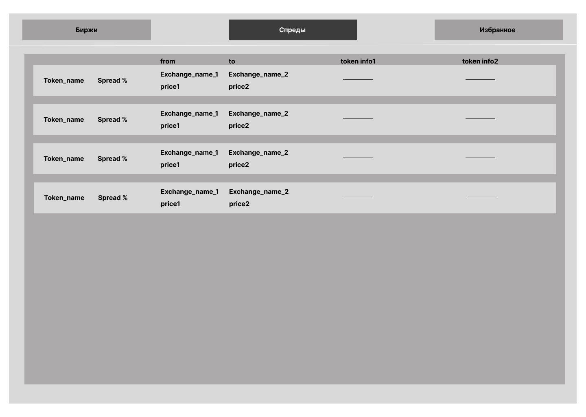
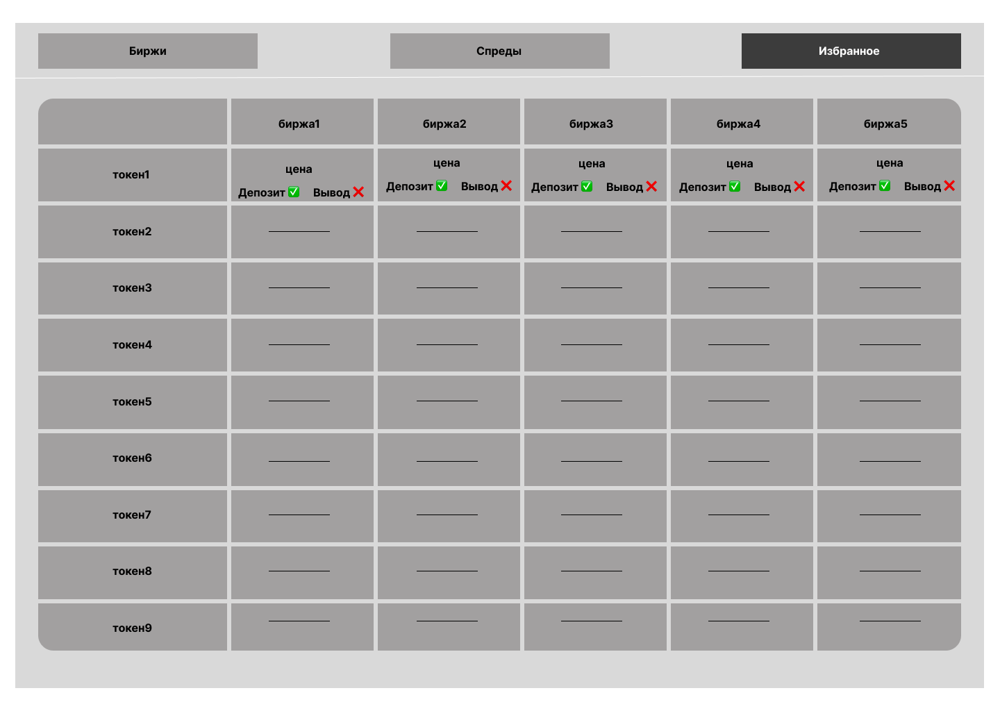

# Требования к проекту «Futures Arbitrage Radar»

---

# Содержание

1 [Введение](#intro)
1.1 [Назначение](#appointment)
1.2 [Бизнес-требования](#business_requirements)
1.2.1 [Исходные данные](#initial_data)
1.2.2 [Возможности бизнеса](#business_opportunities)
1.2.3 [Границы проекта](#project_boundary)
1.3 [Аналоги](#analogues)
2 [Требования пользователя](#user_requirements)
2.1 [Программные интерфейсы](#software_interfaces)
2.2 [Интерфейс пользователя](#user_interface)
2.3 [Характеристики пользователей](#user_specifications)
2.3.1 [Классы пользователей](#user_classes)
2.3.2 [Аудитория приложения](#application_audience)
2.3.2.1 [Целевая аудитория](#target_audience)
2.3.2.2 [Побочная аудитория](#collateral_audience)
2.4 [Предположения и зависимости](#assumptions_and_dependencies)
3 [Системные требования](#system_requirements)
3.1 [Функциональные требования](#functional_requirements)
3.1.1 [Основные функции](#main_functions)
3.1.1.1 [Просмотр цен на токены](#view_token_prices)
3.1.1.2 [Просмотр цен на конкретной бирже](#view_exchange_prices)
3.1.1.3 [Поиск по токену](#search_by_token)
3.1.1.4 [Просмотр спредов](#view_spreads)
3.1.1.5 [Фильтрация и сортировка](#filter_and_sort)
3.1.2 [Ограничения и исключения](#restrictions_and_exclusions)
3.2 [Нефункциональные требования](#non-functional_requirements)
3.2.1 [Атрибуты качества](#quality_attributes)
3.2.1.1 [Требования к удобству использования](#requirements_for_ease_of_use)
3.2.1.2 [Требования к безопасности](#security_requirements)
3.2.1.3 [Требования к доступности](#access_requirements)
3.2.2 [Внешние интерфейсы](#external_interfaces)
3.2.3 [Ограничения](#restrictions)

<a name="intro"/>

# 1 Введение

<a name="appointment"/>

## 1.1 Назначение

В этом документе описаны функциональные и нефункциональные требования к веб‑приложению «Futures Arbitrage Radar». Оно агрегирует данные о ценах фьючерсных контрактов на разных криптобиржах, вычисляет спреды и визуализирует их для пользователей.

<a name="business_requirements"/>

## 1.2 Бизнес-требования

<a name="initial_data"/>

### 1.2.1 Исходные данные

Рынок криптовалют фрагментирован: цены одних и тех же токенов на разных биржах могут отличаться. Для трейдеров важно быстро находить такие расхождения (арбитражные ситуации). Сейчас это требует ручной проверки цен на каждой платформе.

<a name="business_opportunities"/>

### 1.2.2 Возможности бизнеса

Приложение позволит трейдерам и аналитикам:

* видеть цены и спреды на одном экране;
* экономить время на поиске арбитражных возможностей;
* получать данные о статусах депозитов/выводов и параметрах контрактов;
* использовать фильтры и сортировку для анализа.

<a name="project_boundary"/>

### 1.2.3 Границы проекта

В MVP предусмотрены:

* просмотр цен фьючерсов на ≥ 5 биржах;
* поиск по токену и выбор конкретной биржи;
* вычисление и отображение спредов;
* базовые фильтры и сортировки.

Не входят: торговые операции, работа с API-ключами, алерты в реальном времени (будет добавлено позже).

<a name="analogues"/>

## 1.3 Аналоги

* **Coinglass** — отображает метрики фьючерсов, но закрытый API.
* **TradingView** — удобные графики, но нет кросс-биржевых таблиц спредов.
* **Биржевые UI** — дают доступ только к своей площадке.

Наше приложение объединяет данные, нормализует тикеры и делает акцент на быстром выявлении спредов.

<a name="user_requirements"/>

# 2 Требования пользователя

<a name="software_interfaces"/>

## 2.1 Программные интерфейсы

Приложение использует публичные REST и WebSocket API криптобирж (OKX, Bybit, Binance Futures, MEXC, Hyperliquid, Weex и др.).

<a name="user_interface"/>

## 2.2 Интерфейс пользователя

Основные окна:

### Страница биржи (Exchange Page)

### Страница спредов (Spread Page)

### Страница избранных токенов (My Tokens Page)

## 2.3 Характеристики пользователей

<a name="user_classes"/>

### 2.3.1 Классы пользователей

| Класс пользователей                      | Описание                                                                          |
| :--------------------------------------- | :-------------------------------------------------------------------------------- |
| Гости                                    | Могут искать токены, просматривать цены и спреды без регистрации                  |
| Зарегистрированные пользователи (этап 2) | Могут сохранять избранные токены, настраивать уведомления и экспортировать данные |

<a name="application_audience"/>

### 2.3.2 Аудитория приложения

<a name="target_audience"/>

#### 2.3.2.1 Целевая аудитория

Трейдеры и аналитики, работающие с криптовалютными фьючерсами.

<a name="collateral_audience"/>

#### 2.3.2.2 Побочная аудитория

Исследователи и разработчики, которым нужен доступ к унифицированным данным.

<a name="assumptions_and_dependencies"/>

## 2.4 Предположения и зависимости

1. Доступность публичных API бирж;
2. Стабильное интернет-соединение для обновления котировок;
3. Совместимость с современными браузерами.

<a name="system_requirements"/>

# 3 Системные требования

<a name="functional_requirements"/>

## 3.1 Функциональные требования

<a name="main_functions"/>

### 3.1.1 Основные функции

<a name="view_token_prices"/>

#### 3.1.1.1 Просмотр цен на токены

**Описание.** Пользователь вводит название токена и получает таблицу с актуальными ценами на разных биржах.

| Функция         | Требования                                                                  |
| :-------------- | :-------------------------------------------------------------------------- |
| Поиск по токену | Система должна найти все контракты с указанным base-активом и показать цены |

<a name="view_exchange_prices"/>

#### 3.1.1.2 Просмотр цен на конкретной бирже

**Описание.** Пользователь выбирает биржу и видит все её контракты.

| Функция        | Требования                                                         |
| :------------- | :----------------------------------------------------------------- |
| Просмотр биржи | Система должна загрузить и отобразить список всех контрактов биржи |

<a name="search_by_token"/>

#### 3.1.1.3 Поиск по токену

**Описание.** Предусмотрен быстрый поиск по названию токена.

<a name="view_spreads"/>

#### 3.1.1.4 Просмотр спредов

**Описание.** Пользователь может увидеть разницу цен между биржами.

| Функция            | Требования                                                                       |
| :----------------- | :------------------------------------------------------------------------------- |
| Вычисление спредов | Система должна вычислять и отображать разницу в процентах и абсолютных значениях |

<a name="filter_and_sort"/>

#### 3.1.1.5 Фильтрация и сортировка

**Описание.** Доступны фильтры по типу контракта и сортировка по цене, спреду, изменению за 24 часа.

<a name="restrictions_and_exclusions"/>

### 3.1.2 Ограничения и исключения

1. Отсутствие поддержки торговли;
2. Нет возможности подключать API-ключи пользователей;
3. Исторические данные и алерты будут добавлены на следующих этапах.

<a name="non-functional_requirements"/>

## 3.2 Нефункциональные требования

<a name="quality_attributes"/>

### 3.2.1 Атрибуты качества

<a name="requirements_for_ease_of_use"/>

#### 3.2.1.1 Требования к удобству использования

1. Интерфейс адаптивный, поддерживает тёмную/светлую тему;
2. Все элементы интерфейса имеют понятные названия;
3. Время загрузки данных ≤ 3 с.

<a name="security_requirements"/>

#### 3.2.1.2 Требования к безопасности

1. Приложение не хранит приватные API-ключи;
2. Использует только публичные данные бирж;
3. Реализована защита от XSS и CORS.

<a name="access_requirements"/>

#### 3.2.1.3 Требования к доступности

Система должна быть доступна из основных браузеров (Chrome, Firefox, Edge).

<a name="external_interfaces"/>

### 3.2.2 Внешние интерфейсы

UI выполнен как SPA (React + Tailwind). Шрифт и таблицы удобны для анализа данных.

<a name="restrictions"/>

### 3.2.3 Ограничения

1. Реализация — Web-приложение;
2. Языки разработки: Python (backend), TypeScript (frontend);
3. Использование PostgreSQL для кэширования данных и Redis для потоков.
