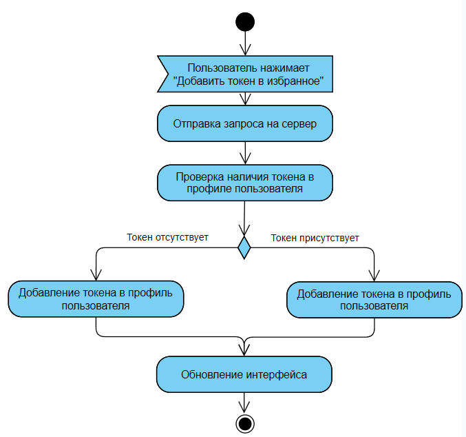

# Диаграммы активностей

---

# Содержание
1. [Страница «Биржи»](#1)
   - [Поиск и фильтрация токенов](#1-1)
   - [Просмотр цен по выбранной бирже](#1-2)
   - [Добавление токена в избранное *(этап 2)*](#1-3)
2. [Страница «Спреды»](#2)
3. [Страница «Избранное» *(этап 2)*](#3)

---

### 1. Страница «Биржи» 

#### 1.1 Поиск и фильтрация токенов 

**Описание процесса:**
1. Пользователь открывает страницу «Биржи».  
2. Вводит название токена или задаёт фильтры (биржи, тип контракта, маржа).  
3. Система обращается к REST/WebSocket API бирж.  
4. Полученные данные нормализуются и отображаются в таблице.  
5. Если данных нет — выводится сообщение «Токен не найден».  

---

#### 1.2 Просмотр цен по выбранной бирже 

**Описание процесса:**
1. Пользователь выбирает конкретную биржу.  
2. Система загружает список контрактов и текущие цены.  
3. Приложение отображает таблицу: **Контракт | Тип | Маржа | Цена | Δ 24h**.  
4. Пользователь может перейти к просмотру спредов или применить фильтры.  

---

#### 1.3 Добавление токена в избранное *(этап 2)* 

**Описание процесса:**
1. Авторизованный пользователь нажимает «☆ Добавить в избранное».  
2. Приложение отправляет запрос на сервер с идентификатором токена.  
3. Сервер сохраняет токен в профиле пользователя.  
4. Интерфейс обновляет список «Избранное».  
5. При повторной попытке добавления выводится сообщение «Уже добавлен».  

---

### 2. Страница «Спреды» 

**Описание процесса:**
1. Пользователь открывает вкладку «Спреды».  
2. Система получает котировки по всем выбранным биржам.  
3. Рассчитывается абсолютный и процентный спред.  
4. Таблица обновляется в реальном времени.  
5. При потере соединения отображается статус «Переподключение…».  

---

### 3. Страница «Избранное» *(этап 2)* 

**Описание процесса:**
1. Пользователь открывает страницу «Избранное».  
2. Система получает список сохранённых токенов.  
3. Для каждого отображает текущие цены, статус `Депозит/Вывод` и процент спреда.  
4. Пользователь может удалить токен или настроить уведомления.  

---

