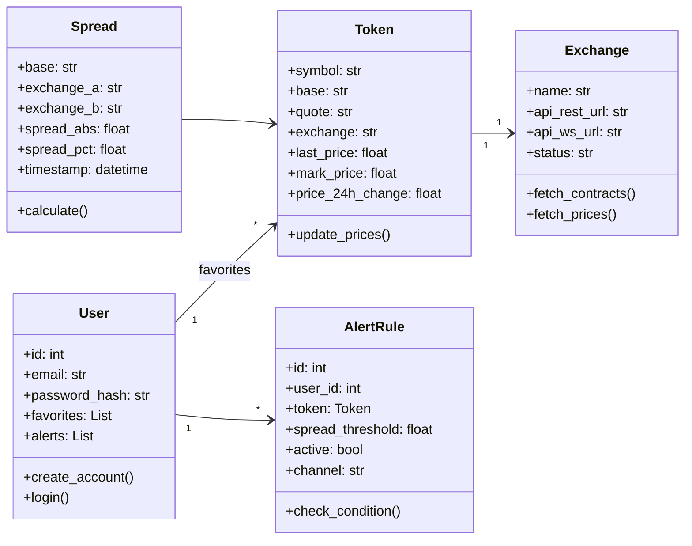
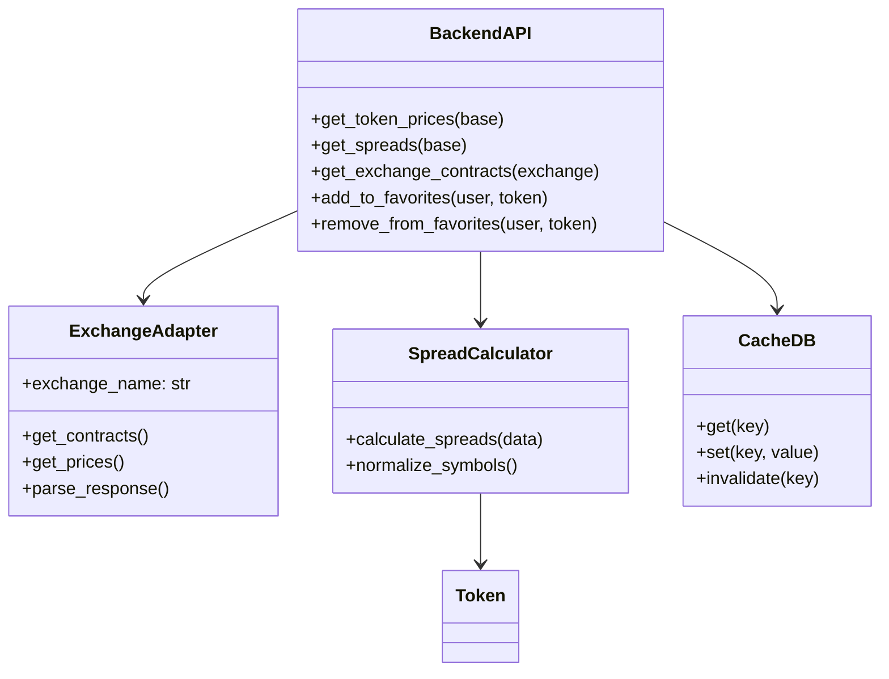
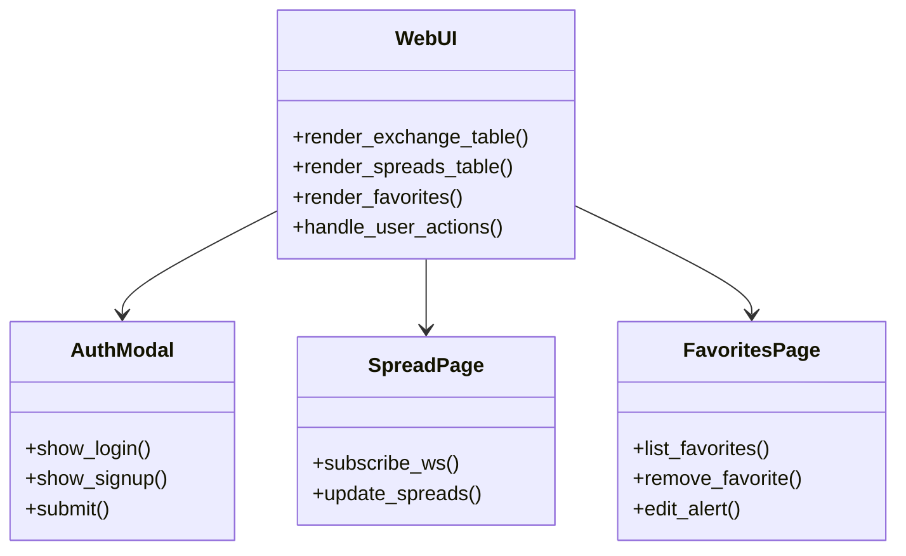

# Диаграмма классов

---

# Содержание
1. [Общая структура приложения](#1)
2. [Backend: основные классы](#2)
3. [Frontend (UI) компоненты](#3)

---

### 1. Общая структура приложения 

### 2. Backend: основные классы 

### 3. Frontend (UI) компоненты 

