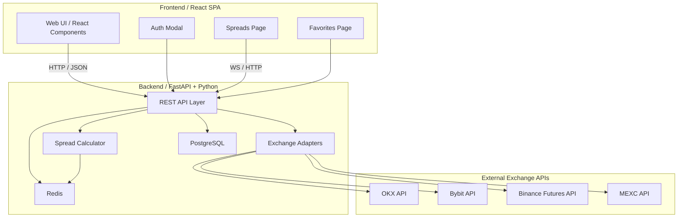
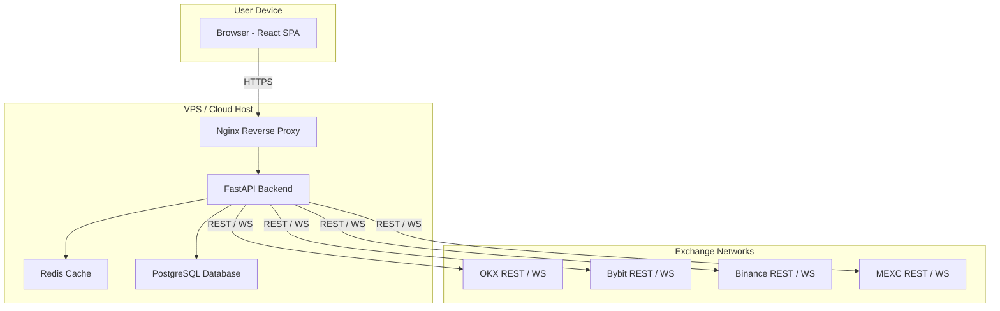

## 🧱 **Component_Deployment.md**

---

# Содержание

1. [Диаграмма компонентов](#components)
2. [Диаграмма развёртывания](#deployment)

---

### 1. Диаграмма компонентов 

### 2. Диаграмма развёртывания 

SPA (React) развёрнута как статические файлы в Nginx, который проксирует /api/* к FastAPI.

Backend (FastAPI) обращается к Redis (кэш) и PostgreSQL (данные пользователей).

Подключения к биржам выполняются через адаптеры с REST/WS каналами.

Возможна контейнеризация: frontend, backend, db, cache в Docker Compose.

---