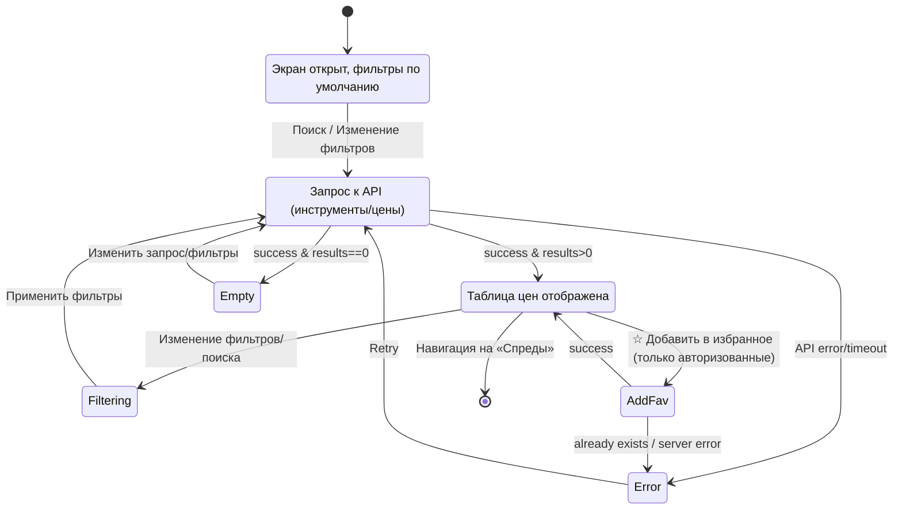
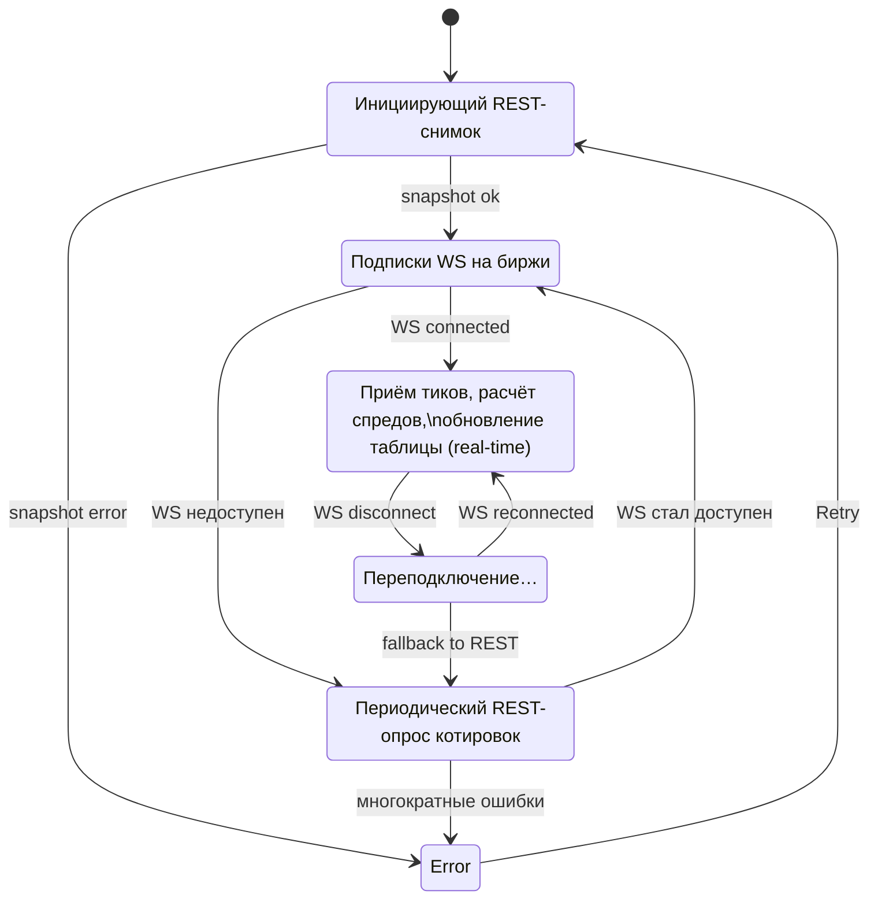
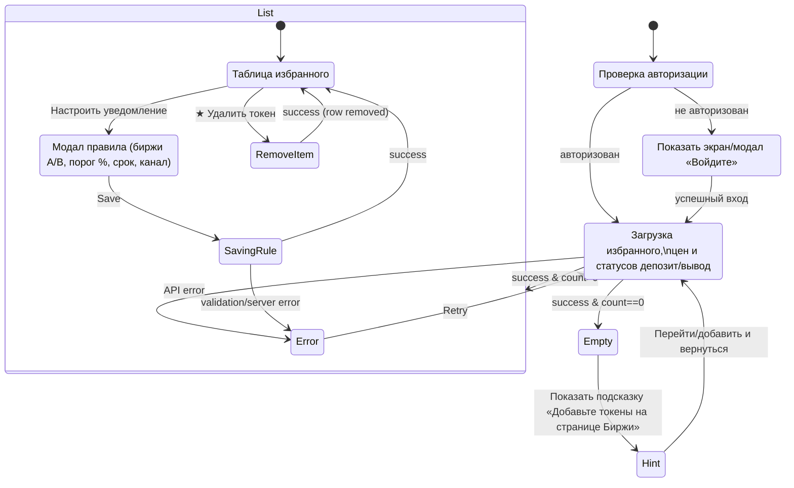

# Диаграммы последовательностей

---

# Содержание
1. [«Биржи» — состояния экрана](#1)
2. [«Спреды» — живое обновление](#2)
3. [«Избранное» (этап 2)](#3)

---

### 1. «Биржи» — состояния экрана 

### 2. «Спреды» — живое обновление 

### 3. «Избранное» (этап 2) 

